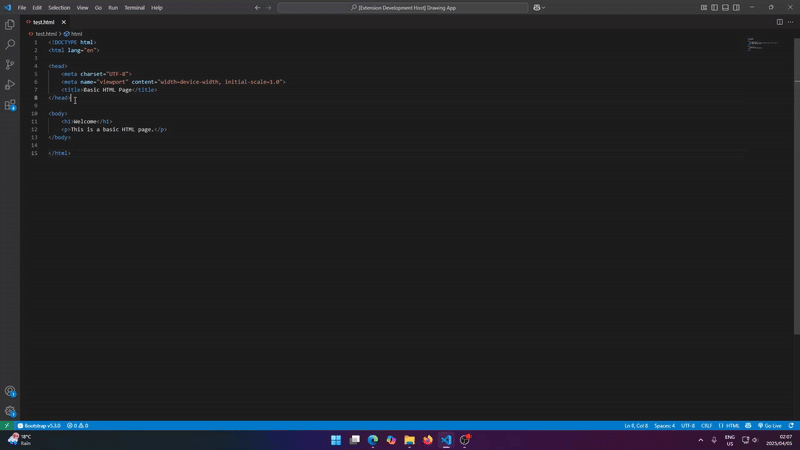

**Gemini Coder — AI-Powered Coding Assistant for VS Code**

Take your coding productivity to the next level with Gemini Coder — an AI extension built for real developers who want precision, clarity, and speed.

Unlike other AI tools, Gemini Coder is non-intrusive — it will never modify or suggest code unless you explicitly ask it to. You’re always in control.

You can even view AI-suggested changes before applying them, so nothing gets overwritten unless you’re ready.

## Features

✅ **Add Comments**  
Smart, human-like comments explain what each part of your code does, making it easier to understand and maintain.

✅ **Clean Code**  
Remove redundant lines, fix formatting, and eliminate clutter instantly.

✅ **Generate Code [PRO Feature]**  
Let AI write entire functions or snippets based on your prompt.

✅ **Selective Editing**  
Only selected text gets modified — Gemini uses the full file for context but edits just what you highlight. No selection? No problem — it can process the entire file too.

✅ **Non-Intrusive by Design**  
The tool never runs in the background or changes anything without your command.

✅ **Preview Changes**  
Choose to see suggested edits first — don't worry about breaking your code.

🧠 **Built for real-world developers**  
🚀 **Lightweight, fast, and focused**  
💻 **Runs directly inside Visual Studio Code**

---

## Requirements

- **Visual Studio Code**
- **Internet access** (required for AI processing)
- **Valid license key** (included with purchase via Gumroad)

---

## Extension Settings

This extension contributes the following settings:

- `gemini-coder.licenseKey`: Set your license key for pro features.
- `gemini-coder.apiKey`: Set your api key for using googles gemini models.
- `gemini-coder.modelName`: Select the model you want to use.

---

## Known Issues

- Large files may lead to slower processing or API timeouts.
- VS Code must have internet access — offline mode is not yet supported.

---

## Release Notes

### 1.0.2

Fixed bug with activation

### 1.0.4

Removed outdated models and added new ones

### 1.0.5

Removed model that was not working with gemini coder

---

## Activate Pro License

To activate the pro features you can get a license at :

- [Get a license](https://gum.new/gum/cma3z94st001203l4fjbycq6z)

**Enjoy Gemini Coder and happy coding!**

